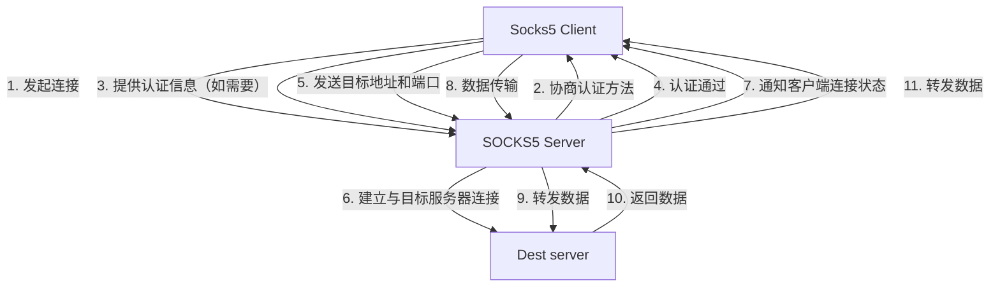

# Intro

Socks5是一个网络传输协议，其主要描述了客户端与外部网络之间进行通讯时应该遵守的规则.

大致通讯流程如下:

> Socks5 Client <==> Socks5 Server <==> Remote Server

## Socks5 Protocl RFC

1. [SOCKS Protocol Version 5](./rfc1928.txt)
2. [Username/Password Authentication for SOCKS V5](./rfc1929.txt)
